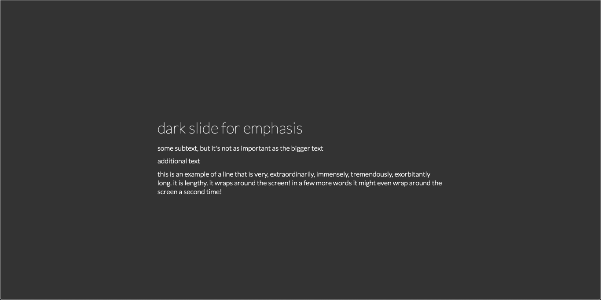

# Confetti Slides

When making my friend a website for his birthday, I had an urge to add confetti, so I did! Then I made a template for others to use! Experience the interactive web experience live [here](https://rswernofsky.com/projects/confetti-slides/).

## What's included?
* pictures and descriptions!

* quotes!

* emojis that get bigger when you scroll over them!

* buttons that change the background color of the slide!

* dark slides!

* and confetti!

